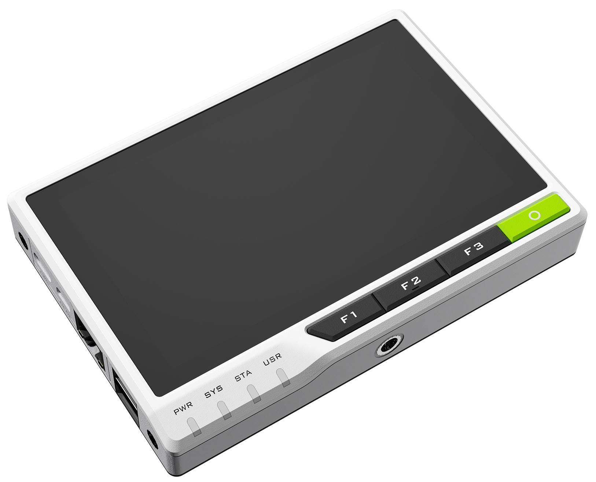

# reterminal-aziot-example

<br>
<div>

</div>
<br>

## Introduction

reTerminal is powered by a Raspberry Pi Compute Module 4 (CM4) which is a Quad-Core Cortex-A72 CPU running at 1.5GHz and a 5-inch IPS capacitive multi-touch screen with a resolution of 720 x 1280. It has sufficient amount of RAM (4GB) to perform multitasking and also has sufficient amount of eMMC storage (32GB) to install an operating system, enabling fast boot up times and smooth overall experience. It has wireless connectivity with dual-band 2.4GHz/5GHz Wi-Fi and Bluetooth 5.0 BLE.

reterminal-aziot-example is an IoT Plug and Play compatible program that allows reTerminal to communicate with Azure IoT.

It has the following features:

* Telemetry
  * Periodically measure the acceleration of the reTerminal and send it to Azure IoT.
  * Notify Azure IoT of button clicks on the front of the reTerminal.
* Property
  * Instructions from Azure IoT will turn on the LED on the front of the reTerminal.
* Command
  * The reTerminal buzzes with instructions from Azure IoT.

## Supported Device Attestation Methods

The following table summarizes supported device attestation/authentication methods :

| Service           | Enrollment | Authentication           | Support status |
|:------------------|:-----------|:-------------------------|:---------------|
| Azure IoT Hub     | -          | Symmetric Key            | **Supported**  |
| Azure IoT Hub     | -          | X.509 Self-Signed        | Not Supported  |
| Azure IoT Hub     | -          | X.509 CA-Signed          | Not Supported  |
| Azure IoT Hub DPS | Group      | Symmetric Key            | **Supported**  |
| Azure IoT Hub DPS | Group      | CA Certificate           | Not Supported  |
| Azure IoT Hub DPS | Group      | Intermediate Certificate | Not Supported  |
| Azure IoT Hub DPS | Individual | Symmetric Key            | **Supported**  |
| Azure IoT Hub DPS | Individual | X.509                    | Not Supported  |
| Azure IoT Hub DPS | Individual | TPM                      | Not Supported  |
| Azure IoT Central | Group      | Symmetric Key            | **Supported**  |
| Azure IoT Central | Group      | CA Certificate           | Not Supported  |

## Prerequisites

You should have the following items ready before beginning the process:

**For Azure IoT Central**
-   [Azure IoT Central application](https://docs.microsoft.com/en-us/azure/iot-central/core/overview-iot-central)

**For Azure IoT Hub**
-   [Azure IoT Hub instance](https://docs.microsoft.com/en-us/azure/iot-hub/about-iot-hub)

## Prepare the Device

1. Download the program

    Clone or download ZIP from the GitHub repository [reterminal-aziot-example](https://github.com/SeeedJP/reterminal-aziot-example).

    ```sh
    git clone https://github.com/SeeedJP/reterminal-aziot-example
    cd reterminal-aziot-example
    ```

2. Install the required Python package

    Install the Python packages listed in the requirements.txt.

    ```sh
    sudo pip3 install -r requirements.txt
    ```

## Run the program

1. Set environment variables

    Set the Azure IoT information to environment variables.

    **For Azure IoT Central**

    New the device, and then set the device connection information to environment variables.

    ```sh
    export IOTHUB_DEVICE_SECURITY_TYPE="DPS"
    export IOTHUB_DEVICE_DPS_ID_SCOPE="<ID scope of device connection>"
    export IOTHUB_DEVICE_DPS_DEVICE_ID="<Device ID (as you wish)>"
    export IOTHUB_DEVICE_DPS_DEVICE_KEY="<Primary key of SAS-IoT-Devices>"
    export IOTHUB_DEVICE_DPS_ENDPOINT="global.azure-devices-provisioning.net"
    ```

    **For Azure IoT Hub**

    New the device, and then set the primary connection string to an environment variable.

    ```sh
    export IOTHUB_DEVICE_SECURITY_TYPE="connectionString"
    export IOTHUB_DEVICE_CONNECTION_STRING="<Primary Connection String>"
    ```

2. Run the program

    Run reterminal_aziot_example.py.

    ```sh
    sudo -E python3 src/reterminal_aziot_example.py
    ```

<hr/>

## For developer

### Configuring

[Configuring the samples](https://github.com/Azure/azure-iot-sdk-python/blob/master/azure-iot-device/samples/pnp/README.md#configuring-the-samples)

**launch.json:**
```json
{
    "version": "0.2.0",
    "configurations": [
        {
            "name": "Python: Current File",
            "type": "python",
            "request": "launch",
            "program": "${file}",
            "console": "integratedTerminal",
            "sudo": true,
            "env":{
                "IOTHUB_DEVICE_SECURITY_TYPE": "DPS",
                "IOTHUB_DEVICE_DPS_ID_SCOPE": "x",
                "IOTHUB_DEVICE_DPS_DEVICE_ID": "x",
                "IOTHUB_DEVICE_DPS_DEVICE_KEY": "x",
                "IOTHUB_DEVICE_DPS_ENDPOINT": "global.azure-devices-provisioning.net"
            }
        }
    ]
}
```

## License

[MIT License](LICENSE.txt)
